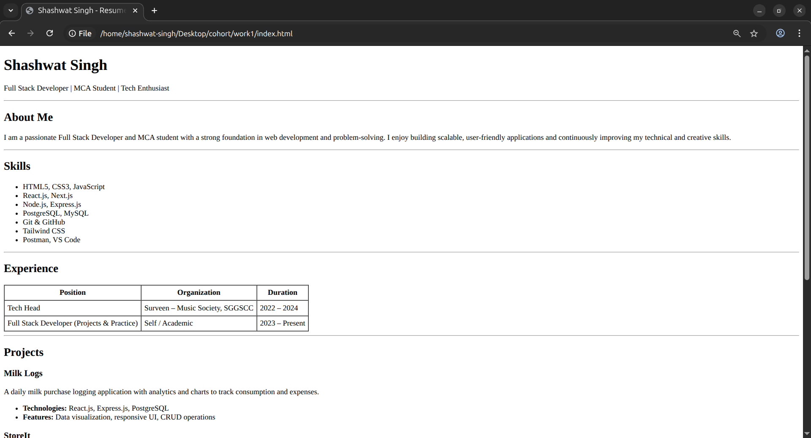

# Resume – Shashwat Singh

This repository contains a **simple, clean HTML-based resume layout** built using only semantic HTML.  
It is designed to be lightweight, easy to customize, and suitable for beginners as well as developers who want a minimal resume page.

---

## 📄 Overview

The resume includes the following sections:

- Header (Name & Role)
- About Me
- Skills
- Experience
- Projects
- Education
- Contact Information

The layout is intentionally kept **CSS-free** for clarity and learning purposes. Styling can be added later if needed.

---
## Screenshots

 
---

## 🛠️ Technologies Used

- HTML5

---

## 📂 Project Structure

```
resume-html/
│├── index.html          # Main HTML file for the resume
│├── README.md           # Project documentation
```

---

## 🚀 How to Use

1. Clone the repository:
   ```bash
   git clone https://github.com/imshashwatsingh/resume-html.git
   ```

2. Navigate to the project folder:

    ```bash
    cd resume-html
    ```

3. Live preview:
   - Open `index.html` in your web browser to view the resume.
